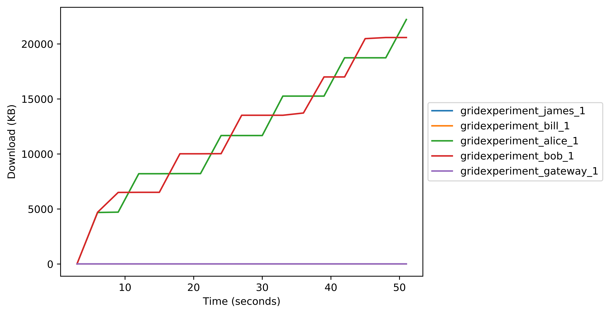

# GridExperiment

Open a fresh ubuntu instance;

```
git clone https://github.com/H4LL/GridExperiment.git
source GridExperiment/run_entire_experiment.sh
```

This should work for any training scenario. Just put your data distribution and training logic into the 'python/connect_nodes.py'. Then run the master script on your fresh host and it will run the experiment and report back with graphs of how it went. For now we are using the logic from [the mnist tutorials on the PyGrid repo](https://github.com/OpenMined/PyGrid/tree/dev/examples/experimental/mnist_federated_example).

## Example Graphs

# CPU Usage


# Memory Usage


# Block Output


# Block Input


# Network Input


# Network Output


### TODO

- Maybe a Byte metric would be better than the percentage metric for memory
