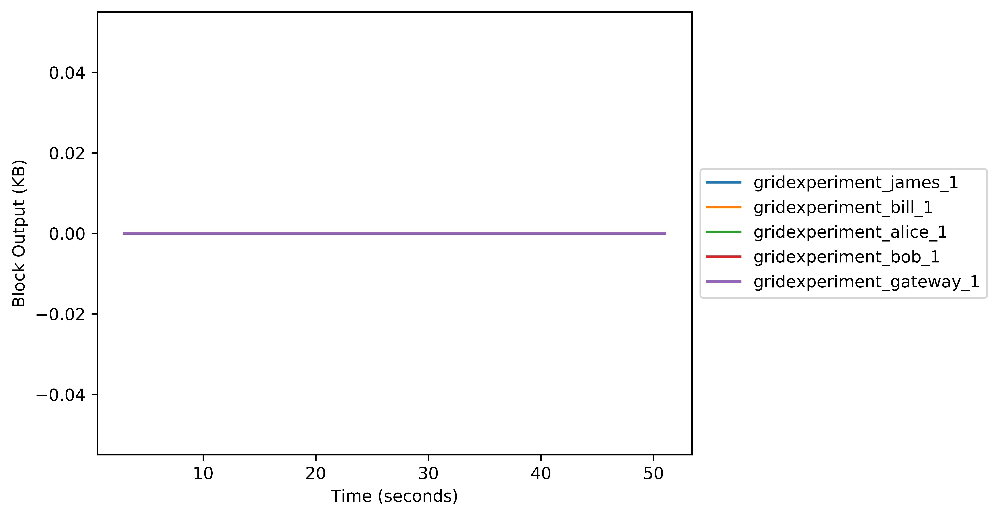

# GridExperiment

Open a fresh ubuntu instance;

```
git clone https://github.com/H4LL/GridExperiment.git
cd GridExperiment
source run_entire_experiment.sh
```

### Graphs





### TODO

- The Kb to Mb in the block i/o  is giving me issus. Need to write a script to pre-process this into a standard.
- Network activity is measured through tcpdump for now as the containers only work on host mode. This should be fixed so we can go on bridged adapter mode. This is better than tcpdump as it keeps up with the tempo of other measurements.
