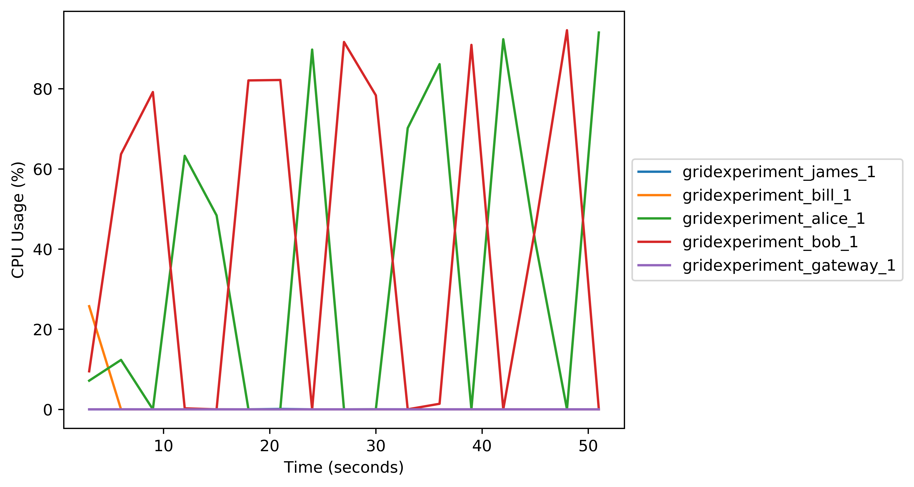
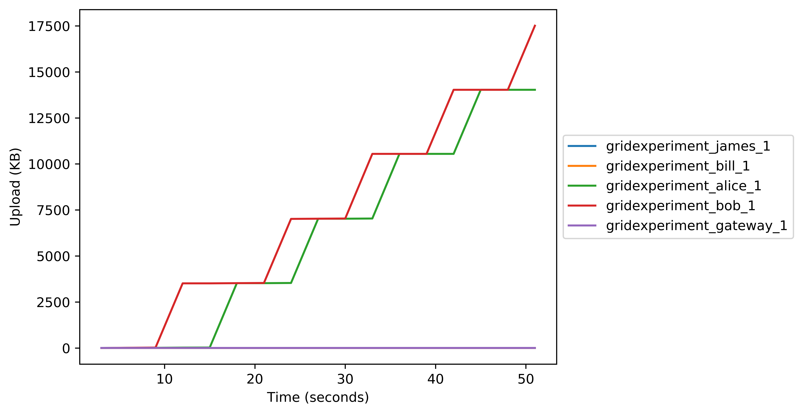

# GridExperiment

Open a fresh ubuntu instance;

```
git clone https://github.com/H4LL/GridExperiment.git
cd GridExperiment
source run_entire_experiment.sh
```

This should work for any training scenario. Just put your data distribution and training logic into the 'python/connect_nodes.py' and 'python/learn_from_nodes.py'. Then run the master script on your fresh host and it will run the experiment and report back with graphs of how it went. For now we are using the logic from [the mnist tutorials on the PyGrid repo](https://github.com/OpenMined/PyGrid/tree/dev/examples/experimental/mnist_federated_example).

## Example Graphs

# CPU Usage


# Memory Usage


# Block Output


# Block Input


# Network Input


# Network Output


### TODO

- The Kb to Mb in the block i/o  is giving me issus. Need to write a script to pre-process this into a standard format (kb). This should make these display correctly
- Network activity is measured through tcpdump for now as the containers only work on host mode. This should be fixed so we can go on bridged adapter mode. This is better than tcpdump as it keeps up with the tempo of other measurements.
- Memory creeps up while training. This is probably because garbage collection is off on the version of PyGrid I'm using. This should really be off for a proper experiment.
